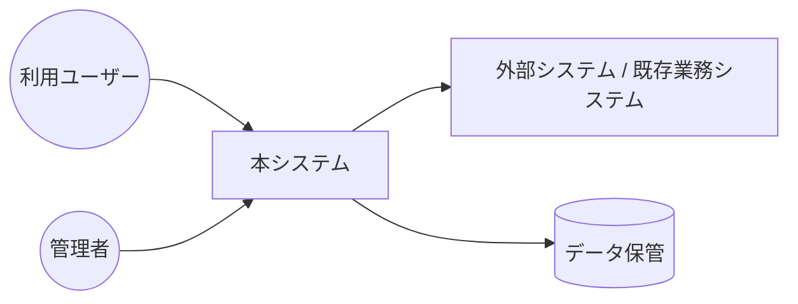
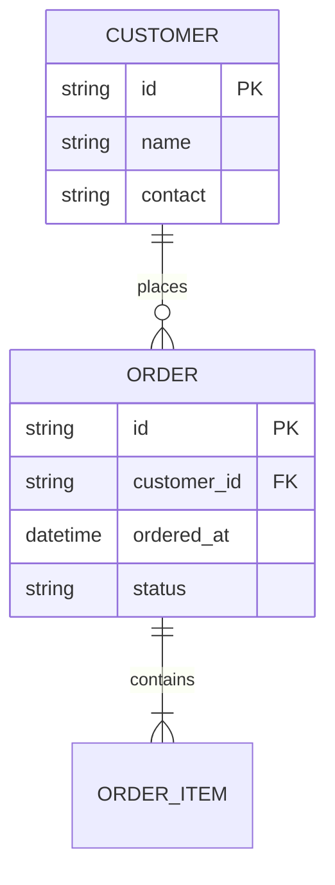
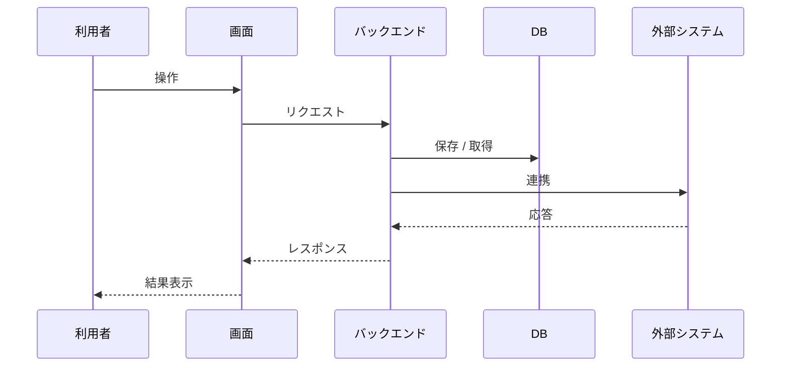

# 設計書（初版）

| 項目 | 内容 |
| --- | --- |
| プロジェクト名 | {{PROJECT_NAME}} |
| 作成日 | {{CREATED_AT}} |
| 作成者 | requirements-design-generator (Claude Code) |
| バージョン | 0.1 (Draft) |
| 関連ドキュメント | [要件定義書](./要件定義書.md) / [用語集](./用語集.md) / [資料インデックス](./資料インデックス.md) |

> ⚠️ 本書は参考資料からの推定をもとに作成された **初版・たたき台** です。技術選定・アーキテクチャ詳細は今後の議論で確定してください。

---

## 1. システム全体イメージ

### 1.1 コンテキスト図

### 1.2 想定利用シーン
- {{誰が、いつ、どこで、どんな端末で使うか}}

## 2. 想定アーキテクチャ・技術スタック（案）

> ⚠️ 要確認: 技術選定は要件・既存資産・運用体制を踏まえて確定が必要

| カテゴリ | 案 | 選定理由 / 検討ポイント |
| --- | --- | --- |
| 提供形態 | Web アプリ / モバイル / デスクトップ / 業務システム埋込 | … |
| フロントエンド | … | … |
| バックエンド | … | … |
| データベース | … | データ件数想定: … |
| 認証 | … | 既存 SSO 有無: … |
| インフラ | クラウド (AWS/GCP/Azure) / オンプレ | … |
| ファイルストレージ | … | … |

## 3. 画面一覧（業務フローから抽出）

| 画面 ID | 画面名 | 概要 | 利用アクター | 関連機能 ID | 出典 |
| --- | --- | --- | --- | --- | --- |
| S-001 | … | … | … | F-001 | [{{資料名}}] |

## 4. データモデル（案）

### 4.1 ER 図

### 4.2 主要エンティティ

#### {{エンティティ名}}

| 項目名 | 型（案） | 必須 | 説明 | 出典 |
| --- | --- | --- | --- | --- |
| id | UUID | ○ | 主キー | （新規） |
| … | … | … | … | [{{資料名}}] |

## 5. 主要ユースケースのシーケンス

### 5.1 {{ユースケース名}}

> 出典: [{{資料名}} / {{該当箇所}}]

## 6. 外部連携設計（案）

| 連携先 | 方式（案） | データフォーマット | 認証 | エラー時挙動 | 出典 |
| --- | --- | --- | --- | --- | --- |
| … | REST / SFTP / メール | JSON / CSV | OAuth / API Key | … | … |

## 7. 運用・保守設計（案）

| 項目 | 案 | 備考 |
| --- | --- | --- |
| デプロイ | … | … |
| バックアップ | 日次 / 世代管理 | … |
| 監視・アラート | … | … |
| ログ保管 | 期間: … | 法令上の要件あり: … |
| 障害対応窓口 | … | … |
| マスタメンテ運用 | … | 誰が、どの画面で |

## 8. 移行・初期データ投入

- **移行元**: {{現状の Excel / 既存システム等}}
- **方針**: 一括移行 / 段階移行 / 並行稼働
- **データクレンジング項目**: …

> ⚠️ 要確認: 移行範囲・件数・タイミング

## 9. 未確定事項・要検討事項

| ID | 項目 | 内容 | 影響範囲 | 期限 |
| --- | --- | --- | --- | --- |
| TBD-001 | … | … | … | … |

---

## 付録 A: 推測で補った設計判断

| 項目 | 推測内容 | 推測根拠 | 確認 |
| --- | --- | --- | --- |
| … | … | … | ☐ |

## 付録 B: 今後の検討課題

- 技術選定の確定
- 性能要件の数値化
- セキュリティ要件の詳細化
- UI/UX 設計の具体化（モック作成）
