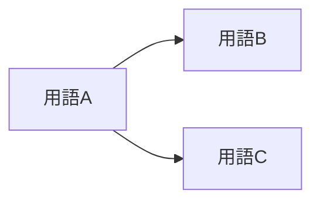

# 用語集

| 項目 | 内容 |
| --- | --- |
| プロジェクト名 | {{PROJECT_NAME}} |
| 作成日 | {{CREATED_AT}} |
| 出典 | `{{SOURCE_DIR}}` 配下の参考資料 |

---

業務領域・業界・社内独自の用語を集約。資料に出てきた表記を尊重し、勝手な言い換えはしない。

| 用語 | 読み | 略称 | カテゴリ | 説明 | 関連用語 | 出典 |
| --- | --- | --- | --- | --- | --- | --- |
| {{用語1}} | {{ふりがな}} | {{略称}} | 業務 / 帳票 / 役割 / ステータス 等 | {{説明}} | {{関連用語}} | [{{資料名}} / {{該当箇所}}] |

## 用語間の関係（必要に応じて）

## 注釈

- 資料間で**表記ゆれ**があった用語: …（要確認）
- **意味が曖昧**だった用語: …（要ヒアリング）
