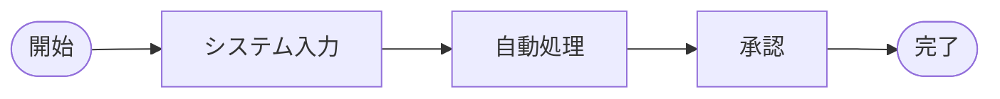

# 要件定義書

| 項目 | 内容 |
| --- | --- |
| プロジェクト名 | {{PROJECT_NAME}} |
| 作成日 | {{CREATED_AT}} |
| 作成者 | requirements-design-generator (Claude Code) |
| バージョン | 0.1 (Draft) |
| 出典 | `{{SOURCE_DIR}}` 配下の参考資料（詳細は [資料インデックス](./資料インデックス.md)） |

---

## 1. プロジェクト概要・目的・背景

### 1.1 背景
{{なぜシステム化が必要になったか / 現状の課題感}}

> 📝 推測: …

### 1.2 目的
- …

### 1.3 期待効果（KPI / KGI）
- …

## 2. 現状業務（As-Is）の整理

### 2.1 業務概要
- **対象業務**: …
- **実施者**: …
- **頻度・タイミング**: …
- **使用ツール（現状）**: Excel / 紙 / メール / …

### 2.2 As-Is 業務フロー

> 出典: [{{資料名}} / {{該当箇所}}]

### 2.3 現状の課題
| ID | 課題 | 影響 | 出典 |
| --- | --- | --- | --- |
| P-001 | … | … | [{{資料名}}] |

## 3. システム化の目的（To-Be）

- {{何を解決するか・どう変わるか}}
- …

## 4. ステークホルダー・アクター

| ロール | 説明 | 主な関心事 | 想定ユースケース |
| --- | --- | --- | --- |
| {{例: 現場担当者}} | … | … | … |
| {{例: 管理者}} | … | … | … |
| {{例: 経営層}} | … | … | … |

## 5. 用語集（要約）

主要用語のみ記載。詳細は [用語集](./用語集.md) を参照。

| 用語 | 説明 |
| --- | --- |
| … | … |

## 6. 業務要件（To-Be 業務フロー）

### 6.1 業務ルール一覧

| ID | ルール | 条件 / 計算式 | 出典 |
| --- | --- | --- | --- |
| R-001 | … | … | [{{資料名}} / {{該当箇所}}] |

## 7. 機能要件

### 7.1 機能一覧

| ID | 機能名 | 概要 | 利用アクター | 優先度 | 出典 |
| --- | --- | --- | --- | --- | --- |
| F-001 | … | … | … | 高/中/低 | [{{資料名}}] |

### 7.2 機能詳細

#### F-001 {{機能名}}

- **概要**: …
- **入力**: …
- **処理ロジック**: …
- **出力**: …
- **業務ルール（参照）**: R-001, R-002
- **画面イメージ**: ({{資料名}} 参照 / 要新規作成)
- **出典**: [{{資料名}} / {{該当箇所}}]

> ⚠️ 要確認: …

## 8. 非機能要件

| カテゴリ | 要件 | 根拠 / 出典 |
| --- | --- | --- |
| 性能 | … | … |
| 可用性 | … | … |
| セキュリティ | 認証方式 / 権限 / 監査ログ | … |
| 運用・監視 | … | … |
| データ保持期間 | … | … |
| 法令・コンプライアンス | 個人情報保護法 / 業界規制 等 | … |
| 国際化・多言語 | … | … |
| アクセシビリティ | … | … |

## 9. データ要件

主要なエンティティと項目（詳細は [設計書](./設計書_初版.md) のデータモデル参照）。

| エンティティ | 概要 | 主要項目 | 出典 |
| --- | --- | --- | --- |
| {{例: 顧客}} | … | 氏名、連絡先、… | [{{資料名}}] |

## 10. 外部連携要件

| 連携先 | 連携方式 | データ内容 | タイミング | 出典 |
| --- | --- | --- | --- | --- |
| … | API / ファイル / メール | … | リアルタイム / 日次 | … |

## 11. 制約事項・前提条件

- **業務上の制約**: 営業時間、繁忙期、…
- **技術上の制約**: 既存システム、ブラウザ、端末、…
- **法令・社内規程**: …
- **コスト・スケジュール**: …

## 12. スコープ外

- …

## 13. リスク・課題

| ID | リスク／課題 | 影響度 | 対応方針 |
| --- | --- | --- | --- |
| RK-001 | … | 高/中/低 | … |

---

## 付録 A: 推測で補った項目（要ユーザー確認）

| 項目 | 推測内容 | 推測根拠 | 確認 |
| --- | --- | --- | --- |
| … | … | … | ☐ |

## 付録 B: 資料間の矛盾点

| 項目 | 資料 A の記述 | 資料 B の記述 | 判断保留 |
| --- | --- | --- | --- |
| … | [{{資料 A}}] … | [{{資料 B}}] … | ☐ |

## 付録 C: 情報不足で記載できなかった項目

- …（追加ヒアリング・追加資料の取得を推奨）
