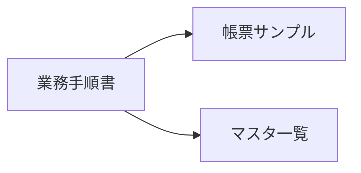

# 資料インデックス

| 項目 | 内容 |
| --- | --- |
| プロジェクト名 | {{PROJECT_NAME}} |
| 作成日 | {{CREATED_AT}} |
| 対象ディレクトリ | `{{SOURCE_DIR}}` |

---

要件定義書・設計書の各記述の根拠となった資料の一覧。`[{{資料名}} / {{該当箇所}}]` 形式の脚注はこの表を指す。

## 1. 調査対象資料

| 資料 ID | 資料名 | 形式 | 場所 | 最終更新 | 概要 | 主要トピック | 参照頻度 |
| --- | --- | --- | --- | --- | --- | --- | --- |
| D-001 | {{資料名}} | Google Doc / .docx / .xlsx / .pdf | {{パス or URL}} | YYYY-MM-DD | … | 業務フロー / 帳票 / ルール 等 | 高/中/低 |

## 2. 調査対象外とした資料

| 資料名 | 除外理由 |
| --- | --- |
| {{古いバージョン}} | 最新版あり |
| {{個人メモ}} | 公式性なし |

## 3. 追加で必要と判断された資料・ヒアリング

| 項目 | 必要理由 | 想定入手先 |
| --- | --- | --- |
| … | … | … |

## 4. 資料の関連図（任意）

